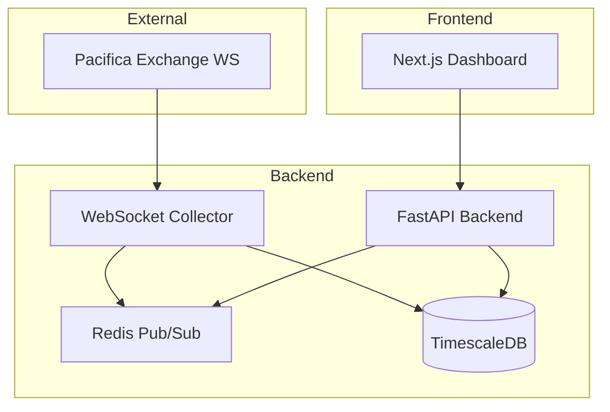

# PacifiScope

Real-Time Orderbook Imbalance Analytics Dashboard for the Pacifica Hackathon (Track 2).

## Architecture



### Components

- **Collector (Python/WebSockets)**: Connects to Pacifica Exchange, calculates real-time orderbook imbalance, and stores it in TimescaleDB while broadcasting via Redis Pub/Sub.
- **API (FastAPI)**: Provides REST endpoints for historical analytics and WebSockets for real-time updates.
- **Database (TimescaleDB)**: Specialized time-series database for high-performance analytics.
- **Cache (Redis)**: Used for low-latency real-time data distribution.
- **Frontend (Next.js/Tailwind)**: Interactive dashboard using Recharts for visualization.

## Service Ports

| Service       | Port |
|---------------|------|
| Frontend      | 3000 |
| API           | 8000 |
| TimescaleDB   | 5432 |
| Redis         | 6379 |

## Quick Start

1. **Clone the repository**
   ```bash
   git clone <repo-url>
   cd pacifiscope
   ```

2. **Set up environment variables**
   ```bash
   cp .env.example .env
   ```

3. **Start the services with Docker**
   ```bash
   docker-compose up --build
   ```

4. **Access the dashboard**
   Open your browser at `http://localhost:3000`.
